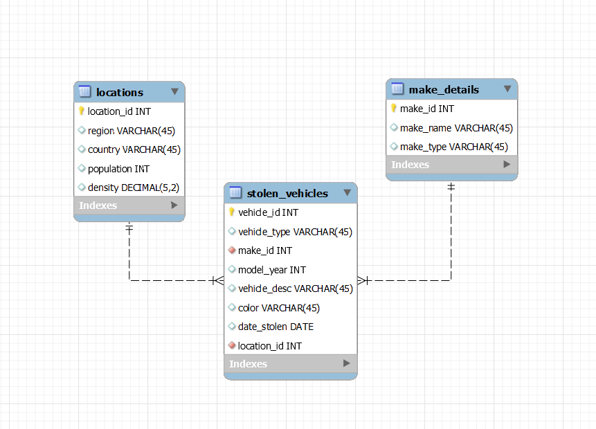
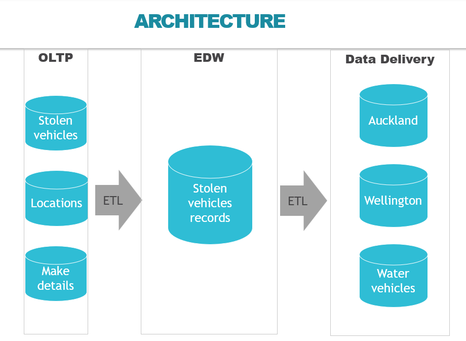
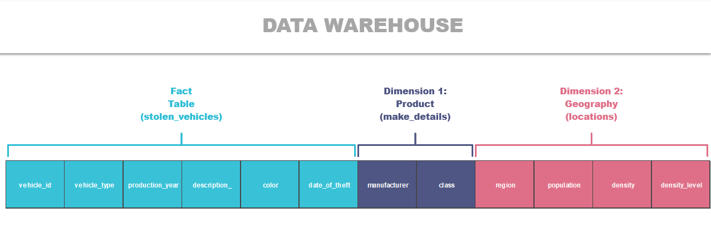
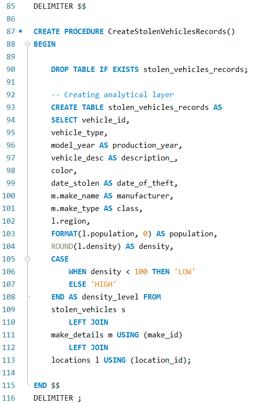
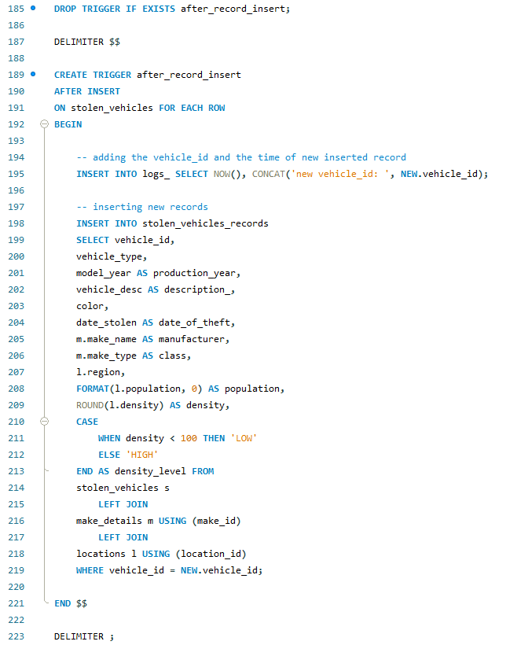

### Table of Content
- [**PART 1: Description and Operational layer**](#part-1-description-and-operational-layer)
- [**PART 2: Analytics plan**](#part-2-analytics-plan)
- [**PART 3: Building the analytical data layer**](#part-3-building-the-analytical-data-layer)
- [**PART 4: ETL pipeline**](#part-4-etl-pipeline)
- [**PART 5: Data marts and analysis**](#part-5-data-marts-and-analysis)

Note: To understand the process of the project you should follow this documentation. Part 1 mostly concludes in `stolen_vehicles_nz.sql` and all remaining parts of this document could be found in `term1_stolen_vehicles.sql`. Also, please, follow the comments in the SQL files.

`EER_model_stolen_vehicles.mwb` represents the EER diagram of the dataset.

Note 2: The project was tested in `Windows` and `MacOS` environments. No issues were found.

 

### Part 1: Description and Operational layer
<!-- content -->
 
The information concerns incidents of Motor Vehicle Thefts, specifically data retrieved from the New Zealand police department's vehicle of interest database over a period of six months. Each entry in the dataset corresponds to a particular stolen vehicle, providing details such as vehicle type, make, year, color, date of theft, and the region from which it was stolen. The data contains information from October 7th, 2021, to April 6th, 2022.

The operational layer of the dataset contains the raw data that is collected from the New Zealand police department's vehicle of interest database. The operational layer of the dataset consists of 3 tables: stolen vehicles, locations, and make_models.

- Stolen vehicle contains: 
    - vehicle_id, vehicle_type (trailer, hatchback, etc.), make_id, model_year, vehicle_desc, color, date_stolen, location_id

- Locations table contains: 
    - location_id, region, country, population, and density

- Make_models contains: 
    - make_id, make_name (Audi, BMW, etc.), make_type (standard, luxury, etc.)

The connection between these 3 tables looks like this:

To build this diagram in a MySQL environment, you can download and open the file named `EER_model_stolen_vehicles.mwb`.

Before we move on to the analytics part, we need to upload the data to MySQL. To do this, run the file named `stolen_vehicles_nz.sql`.
  
### Part 2: Analytics plan
<!-- content -->
 
Using the stolen vehicles dataset we can analyze:

- What days of the week see the highest and lowest rates of vehicle theft?
- Which vehicle types are most and least frequently stolen? Does this vary by region?
- What is the percentage of stolen Luxury cars?
- What is the average age of the stolen vehicles, and does it vary based on the vehicle type?
- What is the number of thefts for different density levels?
- Which regions experience the most and least number of stolen vehicles, and what are the characteristics of these regions?

Using stored procedures and triggers to create the analytical layer allows us to encapsulate the complex logic of the analysis in reusable and maintainable code. Additionally, triggers can be used to automatically update the analytical layer when the data in the operational layer changes. Data marts would help to find answers for police departments in different regions of New Zealand.

Analytics plan could also be found in `term1_stolen_vehicles.sql`.

The architecture of the analytical plan is as follows:

  
### Part 3: Building the analytical data layer
<!-- content -->
 
To answer our questions from PART 2, we are going to create a new denormalized table that will contain information about stolen vehicles, including their types, colors, manufacturers, vehicle classes, production years, vehicle descriptions, dates of theft, locations where they were stolen, as well as additional information such as the population and density of these regions.

The resulting table will look like this:

  
### Part 4: ETL pipeline
<!-- content -->
 
To create the analytical table, we will use triggers and stored procedures (ETL pipelines). If there will be new stolen cars, our analytical table will be updated due to created triggers and stored procedures.

The query for creating the analytical table is:

The query for creating triggers on inserting new rows is:

To follow all processes please run queries from `term1_stolen_vehicles.sql` file.
  
### Part 5: Data marts and analysis
<!-- content -->
 

In the final part, we create data marts as views for police departments in different regions of New Zealand. We also create views for specific types of vehicles like water vehicles. The data marts that we created are "Wellington," "Auckland," and "Water Vehicles."

 

For any questions, please contact: artyomashigov@gmail.com

